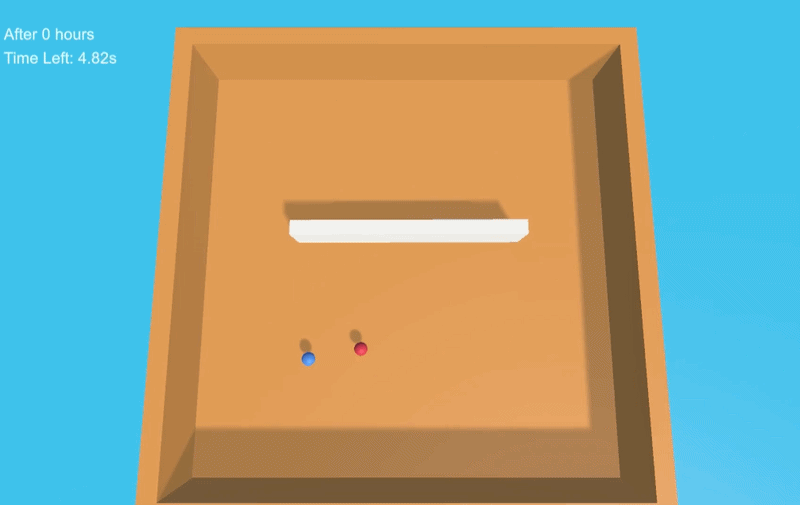

# Unity RL Hide-and-Seek (Teleporting Agents)

## Overview
This project explores reinforcement learning in a competitive tag environment, where a hunter agent attempts to catch a runner agent that can teleport to evade capture.

## Features
- Multi-agent reinforcement learning (hunter vs runner)
- Teleportation ability for dynamic evasion
- Custom reward shaping for both pursuit and survival behaviors
- Emergent behavior from competing objectives
- Parallel training environments for faster learning

## Core Mechanics

### Hunter Agent
- Trained to track and capture the runner
- Optimizes for minimizing distance and interception

### Runner Agent
- Trained to evade the hunter
- Uses teleportation strategically to escape
- Optimizes for increasing distance from hunter

### Teleport Ability
- Adds non-linear movement to the environment
- Forces the hunter to adapt to unpredictable position changes
- Introduces additional complexity in reward design

## Key Challenges
- Designing balanced rewards between agents
- Preventing degenerate strategies (e.g., runner trying to lose on purpose after hitting certain reward threshold)
- Stabilizing training with competing objectives
- Ensuring meaningful use of teleport ability

## Tech Stack
- Unity Engine
- C#
- ML-Agents Toolkit

## Notes
This repository contains the core scripts and logic. Assets and full project files are excluded for size and clarity.